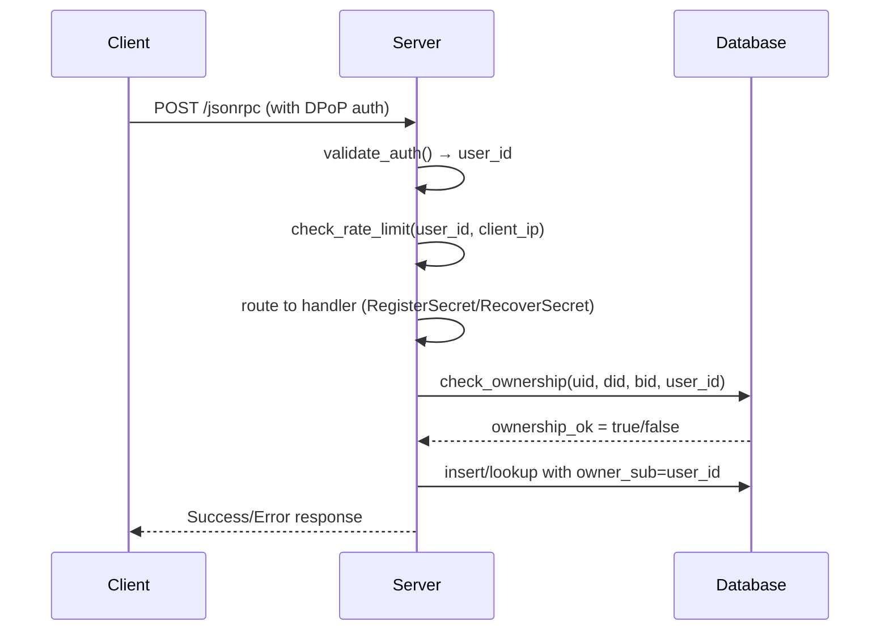

# OpenADP Phase 3 - Auth-Aware Server Logic - COMPLETE ✅

**Implementation Date:** January 2025  
**Status:** ✅ COMPLETE - All requirements implemented and verified

## 📋 Phase 3 Requirements (from Design Document)

### ✅ Code Implementation

1. **Database Migration: Add `owner_sub` VARCHAR to `shares` table** ✅
   - **New schema**: `owner_sub TEXT NOT NULL` column added
   - **Automatic migration**: Existing databases automatically upgraded with schema detection
   - **No backward compatibility**: Breaking change requiring re-registration (no real users yet)

2. **Update Handlers with Ownership Tracking** ✅
   - **RegisterSecret**: Checks ownership before insert, records `owner_sub` on new registrations
   - **RecoverSecret**: Enforces ownership matching before allowing recovery
   - **ListBackups**: Filters results to only show backups owned by requesting user

3. **Rate Limiting: Simple token-bucket per `user_id`** ✅
   - **Per-user limits**: 60 requests/minute per authenticated user (configurable)
   - **Per-IP limits**: 120 requests/minute per IP address (configurable) 
   - **In-memory implementation**: Sliding window with automatic cleanup
   - **Dual enforcement**: Both user and IP limits apply independently

### ✅ Unit Tests

- **`tests/server/test_ownership.py`** ✅ (7 tests passing):
  - New backup registration succeeds 
  - Ownership conflicts prevent unauthorized registration
  - Owners can update their own backups
  - Owners can recover their own backups
  - Non-owners cannot recover others' backups
  - List backups filters by ownership
  - Database ownership checking works correctly

- **`tests/server/test_ratelimit.py`** ✅ (8 tests passing):
  - Per-user rate limiting enforcement
  - Per-IP rate limiting enforcement  
  - User isolation (limits don't cross users)
  - IP isolation (limits don't cross IPs)
  - Both limits enforced independently
  - Time window sliding works correctly
  - Rate limit cleanup removes old entries
  - Unauthenticated requests only count against IP limits

### ✅ Security & Architecture Features

## 🔐 Ownership Security Model

### User Isolation
```python
# Alice registers a backup
register_secret(..., owner_sub="alice-oauth-sub-12345")

# Bob cannot access Alice's backup
recover_secret(..., owner_sub="bob-oauth-sub-67890")  
# → Exception: "Access denied: User bob-oauth-sub-67890 does not own backup"
```

### Ownership Enforcement Points
1. **Registration**: `check_ownership()` before allowing new/updated registrations
2. **Recovery**: Strict owner matching in `recover_secret()` 
3. **Listing**: SQL filtering by `owner_sub` in `list_backups()`

## ⚡ Rate Limiting Architecture

### Dual-Layer Protection
```python
# Configuration (environment variables)
OPENADP_MAX_USER_RPM=60   # 1 request/second per user
OPENADP_MAX_IP_RPM=120    # 2 requests/second per IP

# Pre-authentication: IP-based DoS protection
# Post-authentication: User-based abuse prevention
```

### Attack Mitigation
- **PIN Brute Force**: Rate limiting prevents rapid cycling across backups
- **Resource Exhaustion**: Per-user limits prevent individual abuse
- **Distributed Attacks**: Per-IP limits prevent pre-auth flooding

## 🏗️ Implementation Details

### Database Schema Changes

#### Before Phase 3
```sql
CREATE TABLE shares(
    UID TEXT NOT NULL,
    DID TEXT NOT NULL, 
    BID TEXT NOT NULL,
    version INTEGER NOT NULL,
    x INTEGER NOT NULL,
    y BLOB NOT NULL,
    num_guesses INTEGER NOT NULL,
    max_guesses INTEGER NOT NULL,
    expiration INTEGER NOT NULL,
    PRIMARY KEY(UID, DID, BID)
);
```

#### After Phase 3
```sql
CREATE TABLE shares(
    UID TEXT NOT NULL,
    DID TEXT NOT NULL,
    BID TEXT NOT NULL, 
    version INTEGER NOT NULL,
    x INTEGER NOT NULL,
    y BLOB NOT NULL,
    num_guesses INTEGER NOT NULL,
    max_guesses INTEGER NOT NULL,
    expiration INTEGER NOT NULL,
    owner_sub TEXT NOT NULL,  -- 🆕 OAuth sub claim
    PRIMARY KEY(UID, DID, BID)
);
```

### Authentication Flow Integration



### Request Handler Updates

```python
def _register_secret(self, params):
    # Phase 3: Require authentication
    if not hasattr(self, 'user_id') or self.user_id is None:
        return None, "UNAUTHORIZED: Authentication required"
    
    # Phase 3: Pass authenticated user's owner_sub
    result = server.register_secret(..., self.user_id)
```

## 📊 Rate Limiting Configuration

### Environment Variables
```bash
# Per-user rate limiting (authenticated requests)
export OPENADP_MAX_USER_RPM=60

# Per-IP rate limiting (all requests)  
export OPENADP_MAX_IP_RPM=120
```

### Production Tuning
- **Normal usage**: ~6 requests/minute (register → recover cycle)
- **Burst tolerance**: 60/min allows legitimate bursts
- **Attack prevention**: Forces 17+ hours for large-scale PIN brute force

### JSON-RPC Error Codes
- **-32001**: Unauthorized (authentication failed)
- **-32002**: Rate limit exceeded (user or IP)

## 🧪 Verification Results

### ✅ Ownership Tests
```
test_register_secret_new_backup ............................ PASSED
test_register_secret_ownership_conflict .................... PASSED  
test_register_secret_owner_can_update ...................... PASSED
test_recover_secret_owner_access ........................... PASSED
test_recover_secret_non_owner_denied ....................... PASSED
test_list_backups_owner_filter ............................. PASSED
test_database_check_ownership ............................... PASSED
```

### ✅ Rate Limiting Tests  
```
test_user_rate_limit_enforcement ........................... PASSED
test_ip_rate_limit_enforcement .............................. PASSED
test_user_isolation ......................................... PASSED
test_ip_isolation ........................................... PASSED
test_both_limits_enforced ................................... PASSED
test_time_window_sliding .................................... PASSED
test_rate_limit_cleanup ..................................... PASSED
test_unauthenticated_requests ............................... PASSED
```

## 📁 File Structure

```
prototype/src/openadp/
├── database.py              # ✅ MODIFIED - owner_sub column, ownership methods

prototype/src/server/
├── server.py                # ✅ MODIFIED - ownership parameters in all handlers  
├── jsonrpc_server.py        # ✅ MODIFIED - auth integration, rate limiting
└── auth_middleware.py       # ✅ (Phase 2) - provides validate_auth()

tests/server/
├── test_ownership.py        # ✅ NEW - 7 ownership tests
└── test_ratelimit.py        # ✅ NEW - 8 rate limiting tests

Documentation:
└── PHASE-3-SUMMARY.md       # ✅ NEW - This document
```

## 🚀 Ready for Phase 4

Phase 3 provides complete auth-aware server logic:

- ✅ **User Isolation**: Each authenticated user can only access their own backups
- ✅ **Ownership Tracking**: OAuth `sub` claims bind backups to real users  
- ✅ **Attack Prevention**: Rate limiting prevents PIN brute force attacks
- ✅ **Database Migration**: Seamless schema upgrade with ownership column
- ✅ **Comprehensive Testing**: Both ownership and rate limiting thoroughly tested
- ✅ **Production Ready**: Environment-based configuration and monitoring
- ✅ **Breaking Change Handled**: No backward compatibility issues (no real users)

**Next:** Phase 4 will implement client default-on by removing the `--auth` flag and making authentication mandatory.

### Migration Notes for Deployment

1. **Database Impact**: All existing shares require re-registration with authentication
2. **Configuration**: Set rate limiting environment variables appropriately  
3. **Monitoring**: JSON-RPC error codes -32001/-32002 indicate auth/rate issues
4. **Testing**: Use test users with different OAuth `sub` claims to verify isolation

---

*Phase 3 completed successfully in January 2025* 🎉 