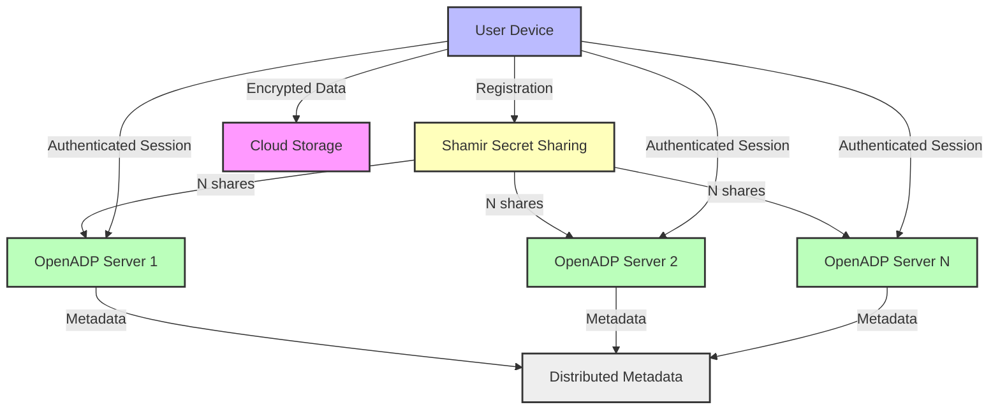
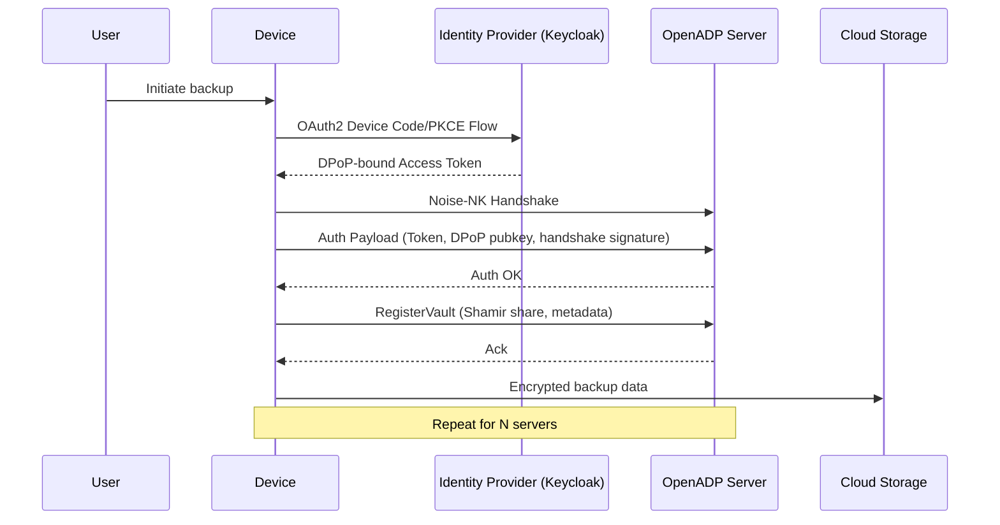
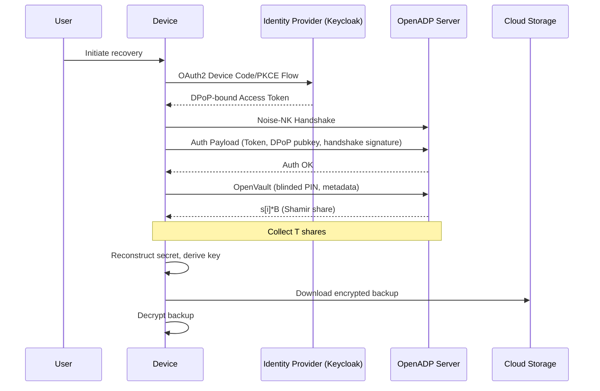
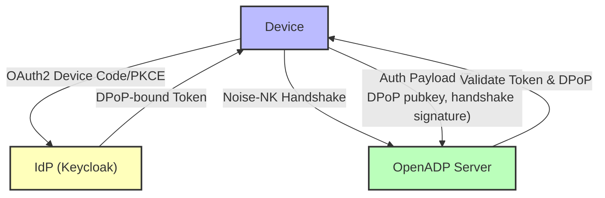

# OpenADP Detailed Design Document

## 1. Introduction

OpenADP (Open Advanced Data Protection) is an open-source, distributed, threshold-based key management and backup protection system. Its mission is to provide nation-state-resistant, end-to-end encrypted (E2EE) data protection for everyone, especially for cloud backups, passwords, and sensitive user data. OpenADP is designed to:

- Eliminate the risk of secret mass surveillance backdoors (as seen in proprietary systems).
- Provide transparency and distributed trust: users do not need to trust any single operator, but only that a threshold (T) of N OpenADP nodes are honest.
- Allow users to recover their data even if some OpenADP servers are offline or compromised.
- Support integration with existing applications (e.g., password managers, disk encryption, phone backups).

**Design Philosophy:**
- All cryptographic operations are open, auditable, and use well-studied primitives.
- The system is modular: authentication, transport, and key management are cleanly separated.
- The threat model assumes some servers may be malicious or compelled by law, but not a threshold T of N.

---

## 2. High-Level Architecture

OpenADP is a distributed system with the following main actors:
- **User Device**: The client (e.g., phone, laptop) that performs backup and recovery.
- **OpenADP Servers**: Independent nodes that each hold a share of the user's secret.
- **Identity Provider (IdP)**: OIDC-compliant server (e.g., Keycloak) for authentication.
- **Cloud Storage**: Where encrypted user data is stored (not part of OpenADP itself).

### 2.1 System Diagram

### 2.2 Why Distributed Servers?

- **Trust Model**: No single entity can compromise user data. Even if some servers are malicious or compelled by law, as long as the threshold T is not reached, user data remains safe.
- **Fault Tolerance**: Users can recover data as long as T of N servers are online.
- **Transparency**: All code is open source, and the distributed model makes it much harder to introduce undetectable backdoors.
- **Global Policy**: Governments must negotiate with multiple independent operators in different jurisdictions to access user data, making mass surveillance impractical.

**Implementation Note:**
- Each server is independently operated and can be run by different organizations or individuals. The system is designed to be easy to deploy and federate.

---

## 3. Data Protection and Recovery Flows

### 3.1 Registration (Backup Creation)

#### Protocol Steps
1. **User Device** generates a strong random secret `s` (256 bits).
2. **Shamir Secret Sharing** splits `s` into N shares (`s[1]`, ..., `s[N]`), with threshold T.
3. **Blinded PIN/Password**: The device computes a blinded elliptic curve point `U = H(UID, DID, BID, pin)` and `B = r*U` (where `r` is a random blinding factor).
4. **Key Derivation**: Computes `S = s*U` and derives `enc_key = HKDF(S.x | S.y)`.
5. **Server Registration**: Registers each share with a different OpenADP server, along with metadata (UID, DID, BID, etc.).
6. **Backup**: Data is encrypted with `enc_key` and stored in the cloud.

#### Registration Sequence Diagram

#### Implementation Notes
- The device must securely erase `s` after registration.
- The metadata stored on each server includes guess counters, expiration, and device identifiers.
- All communication is over Noise-NK encrypted channels.

### 3.2 Recovery (Restore)

#### Protocol Steps
1. **User** provides their PIN/password on a new device.
2. **Device** computes the blinded value `B = r*U` and requests shares from at least T servers.
3. **Servers** return their shares of `s[i]*B`.
4. **Device** reconstructs `s*B` using Shamir recovery, then computes `S = (1/r) * s*B`.
5. **Key Derivation**: Computes `enc_key = HKDF(S.x | S.y)`.
6. **Decryption**: Downloads and decrypts the backup from cloud storage.

#### Recovery Sequence Diagram

#### Implementation Notes
- The device must verify the decrypted data to confirm the correct PIN/password was used.
- After successful recovery, the device should re-register to rotate keys and reset guess counters.

### 3.3 Key Rotation

- After a successful recovery, the device should re-register with OpenADP, generating a new secret and shares, to reset guess counters and refresh the quorum.
- Key rotation is also recommended after a set period or after a device change.

---

## 4. Authentication and Authorization

### 4.1 Authentication Flow

All state-changing operations require authentication. OpenADP uses OAuth2 with DPoP and Noise-NK for secure, session-bound authentication.

#### Protocol Details
1. **Device** initiates OAuth2 Device Code or PKCE flow with the IdP (e.g., Keycloak).
2. **User** authenticates (with passkey, 2FA, etc.) and receives a DPoP-bound access token.
3. **Device** establishes a Noise-NK encrypted channel to each OpenADP server.
4. **Device** sends the access token, DPoP public key, and handshake signature inside the encrypted channel.
5. **Server** validates the token, verifies the DPoP signature, and binds the session.
6. **All further RPCs** (e.g., RegisterVault, OpenVault) are authenticated and authorized per user.

#### Implementation Notes
- DPoP tokens are never visible to network intermediaries (e.g., Cloudflare).
- Servers cache JWKS keys for offline validation and privacy.
- Per-user and per-backup quotas are enforced to prevent brute-force and DoS attacks.
- Multi-issuer support allows for federated and enterprise deployments.

---

## 5. Security Model

OpenADP's security model is layered and defense-in-depth:

```mermaid
flowchart TD
    subgraph SecurityLayers[Security Layers]
        A["User PIN/Password"] --> B["Blinding (Elliptic Curve)"]
        B --> C["Shamir Secret Sharing"]
        C --> D["Distributed OpenADP Servers"]
        D --> E["Noise-NK Encrypted Channel"]
        E --> F["DPoP-bound OAuth2 Token"]
        F --> G["Per-user/backup quotas, rate limiting"]
        G --> H["Audit Logging"]
    end
    style A fill:#bbf,stroke:#333,stroke-width:2
    style B fill:#eef,stroke:#333,stroke-width:2
    style C fill:#ffb,stroke:#333,stroke-width:2
    style D fill:#bfb,stroke:#333,stroke-width:2
    style E fill:#f9f,stroke:#333,stroke-width:2
    style F fill:#ffd,stroke:#333,stroke-width:2
    style G fill:#eee,stroke:#333,stroke-width:2
    style H fill:#ccc,stroke:#333,stroke-width:2
```

### 5.1 Threat Model
- **Remote attacker**: Can reach any OpenADP node, guess PINs, attempt brute force. Mitigated by authentication, quotas, and blinded PINs.
- **Malicious user**: Authenticated but tries to abuse guess limits. Mitigated by per-user and per-backup quotas.
- **Compromised node**: Can read its own DB, but cannot reconstruct secrets without T shares.
- **Compromised IdP**: Can issue tokens, but cannot decrypt user data without T server collusion.

### 5.2 Security Properties
- **End-to-end encryption**: No intermediary (including Cloudflare) can see tokens or data.
- **Session binding**: Authentication is tied to a specific Noise-NK session.
- **Replay protection**: DPoP and session binding prevent token reuse.
- **Aggressive JWKS caching**: Minimizes network calls to IdPs, improving privacy and reliability.
- **Per-user and per-backup quotas**: Prevent brute-force attacks and abuse.
- **Audit logging**: All state-changing operations are logged with user identity.

---

## 6. Rationale for Distributed Trust

- **No single point of failure**: Even if some OpenADP servers are compromised, user data remains safe as long as the threshold T is not reached.
- **Resistance to legal compulsion**: Governments must coordinate with multiple independent operators in different jurisdictions to access user data.
- **Transparency and auditability**: Open source code and distributed operation make it much harder to introduce undetectable backdoors.
- **Community-driven**: Anyone can run an OpenADP server, increasing diversity and resilience.

**Implementation Note:**
- The system is designed to be easy to federate and to support both community and enterprise deployments.
- Operators can choose their own IdP, and servers can trust multiple issuers for federation.

---

## 7. Implementation Status and Roadmap

- **Phase 5 complete**: All client operations require authentication; global Keycloak server is default.
- **Noise-NK authentication**: Fully implemented and replaces HTTP header-based DPoP.
- **All major flows (registration, backup, recovery) are implemented and tested.**
- **Python test/debug scripts**: Extensively test authentication, callback flows, and server configuration.

**Next Steps:**
- Production hardening (monitoring, alerting, rate limiting)
- Multi-issuer federation and enterprise support
- Enhanced offline JWKS validation
- Community server onboarding and operator documentation

---

## 8. References

- [OpenADP README](../README.md)
- [Authentication & Authorization Design](./authn-authz-design.md)
- [Noise-NK Protocol Guide](./NOISE_NK_GUIDE.md)
- [Phase Summaries](../PHASE-*.md)

---

## 9. Deep Dives & Implementation Notes

### 9.1 Cryptographic Primitives and Protocol Details
- **Elliptic Curve**: Curve25519 (or Ed25519) for all point operations and key derivation.
- **Hash Function**: SHA-256 for all hashes, including mapping to curve points (using a safe hash-to-curve method).
- **Key Derivation**: HKDF (HMAC-based Key Derivation Function) for deriving encryption keys from curve points.
- **Shamir Secret Sharing**: Standard polynomial-based scheme, with threshold T and total N shares. Shares are never reused across users or backups.
- **Blinding**: Scalar multiplication and modular inversion are used to blind/unblind user PINs/passwords, making brute-force attacks infeasible even for weak secrets.
- **Noise-NK**: Used for all client-server transport, providing forward secrecy and mutual authentication (server authenticates via static key, client via DPoP-bound token).
- **DPoP**: RFC 9449, with ES256 (P-256) signatures. The DPoP public key is included in the OAuth2 token's `cnf` claim.

### 9.2 Protocol Edge Cases & Error Handling
- **Guess Counters**: Each backup has a per-server guess counter. If the user exceeds the allowed number of guesses, the share is deleted or locked.
- **Expiration**: Backups and shares have expiration dates. Expired shares are deleted.
- **Partial Recovery**: If some servers are offline, the client must retry with other servers until T shares are collected.
- **Replay Attacks**: DPoP and session binding prevent replay, but all tokens and nonces must be checked for uniqueness and freshness.
- **Token Revocation**: If a user's token is revoked at the IdP, the server must reject further requests after cache expiry.
- **Key Rotation**: After successful recovery, the client must re-register to avoid guess exhaustion and to refresh the quorum.
- **Legacy/Upgrade**: The system must handle files and backups created with older protocol versions (e.g., unauthenticated backups, different key derivation).

### 9.3 Extensibility & Modularity
- **Pluggable IdP**: The system supports multiple OIDC issuers. Adding a new IdP requires only configuration.
- **Server Federation**: Servers can be added/removed from the quorum without breaking existing backups (as long as T of N are available for each backup).
- **Client Extensibility**: The client is modular, with separate modules for authentication, transport, key management, and backup logic.
- **API Versioning**: All RPCs are versioned. Backward compatibility is maintained where possible.

### 9.4 Testing & Verification
- **Unit Tests**: All cryptographic operations, protocol steps, and error cases are covered by unit tests.
- **Integration Tests**: End-to-end flows (registration, backup, recovery) are tested with real servers and IdP.
- **Fuzzing**: Protocol parsers and cryptographic routines are fuzzed for robustness.
- **Test Vectors**: Standardized test vectors are used for Shamir, Noise-NK, and DPoP.
- **Continuous Integration**: All tests are run in CI for every commit.

### 9.5 Operational Considerations
- **Monitoring**: Servers export Prometheus metrics for authentication success/failure, rate limits, and error rates.
- **Alerting**: Operators are alerted on abnormal error rates, guess exhaustion, or server downtime.
- **Backup/Restore**: Server state (shares, metadata) is backed up securely and can be restored in case of hardware failure.
- **Key Management**: Server private keys (Noise static keys) are stored securely, with rotation procedures documented.
- **Privacy**: No user secrets or identifying information are logged. Audit logs contain only pseudonymous user IDs (from JWT `sub`).

### 9.6 Glossary
- **UID**: User ID (e.g., email address or UUID)
- **DID**: Device ID (unique per device)
- **BID**: Backup ID (unique per backup)
- **PIN**: User's secret (e.g., phone unlock code)
- **U**: Blinded curve point derived from UID, DID, BID, and PIN
- **s**: Strong random secret (split via Shamir)
- **B**: Blinded point (r*U)
- **S**: Secret point (s*U)
- **enc_key**: Encryption key derived from S
- **T**: Threshold for Shamir recovery
- **N**: Total number of OpenADP servers
- **DPoP**: Demonstration of Proof-of-Possession (RFC 9449)
- **Noise-NK**: Cryptographic handshake protocol
- **IdP**: Identity Provider (e.g., Keycloak)

### 9.7 Open Questions & Future Research
- **Post-Quantum Security**: How to migrate to PQ-safe primitives if/when needed?
- **Hardware Security Modules**: Should servers support HSMs for key storage?
- **Decentralized IdP**: Can we support decentralized/federated identity (e.g., WebAuthn-only, or DID-based)?
- **User Experience**: How to make recovery flows as user-friendly as possible, especially for non-technical users?
- **Server Incentives**: How to incentivize independent operation and prevent Sybil attacks?
- **Zero-Knowledge Proofs**: Can we add ZKPs to further reduce trust in servers?
- **Multi-Device Sync**: How to securely sync keys across multiple user devices?

---

*This document is maintained as of June 2025. For the latest updates, see the project repository and documentation.* 